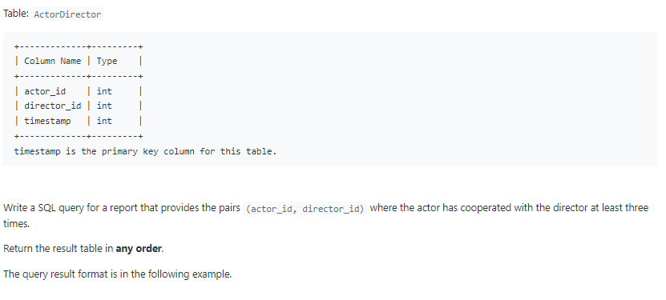
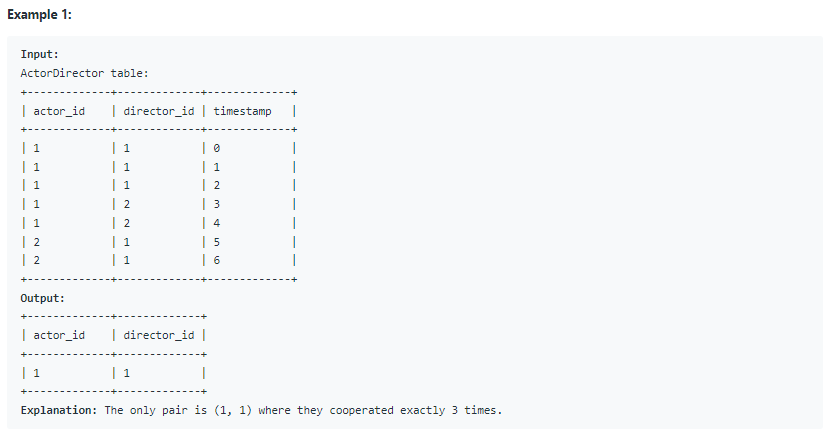

# Oracle Practice 08/07/2022

## Actors and Directors Who Cooperated At Least Three Times

- SQL schema:

  

- Example:

  

- <ins>query:</ins>

  ```sql
  select
    actor_id,
    director_id
  from ActorDirector
  group by actor_id, director_id
  having count(*) >= 3
  ```
