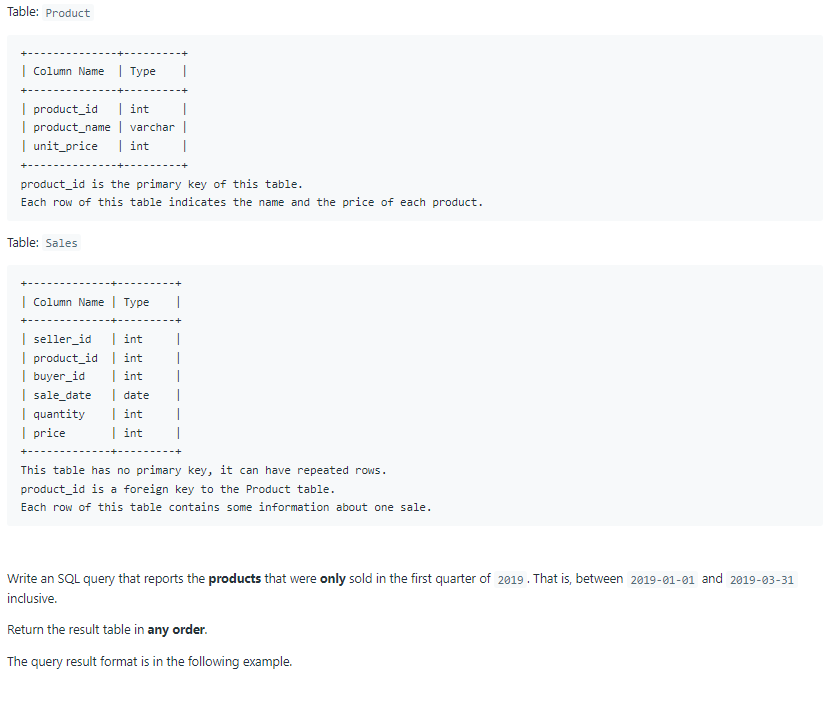
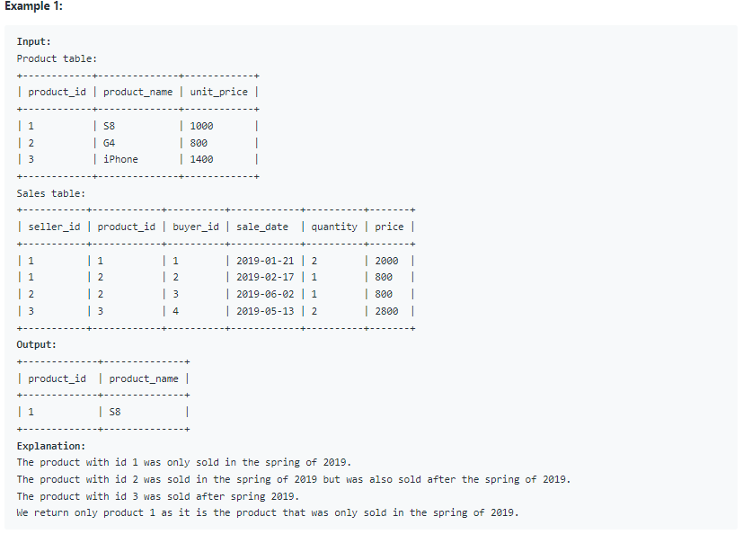

# Oracle Practice 08/07/2022

## User Activity for the Past 30 Days I

- SQL schema:

  

- Example:

  

- <ins>query:</ins>

  ```sql
    select product_id, product_name
    from Product
    where product_id in (
        select distinct product_id
        from Sales
        where sale_date between '2019-01-01' and '2019-03-31'
    )
    and product_id not in (
        select distinct product_id
        from Sales
        where sale_date < '2019-01-01'
            or sale_date > '2019-03-31'
    )
  ```
