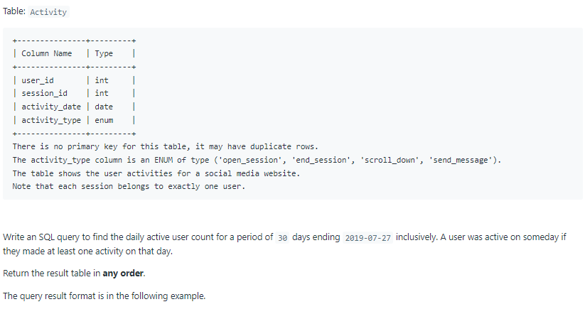
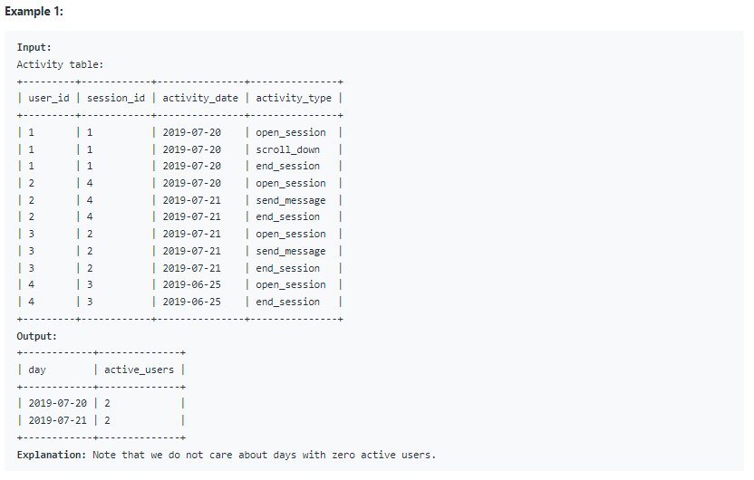

# Oracle Practice 08/07/2022

## User Activity for the Past 30 Days I

- SQL schema:

  

- Example:

  

- <ins>query:</ins>

  ```sql
  select
    to_char(activity_date,'yyyy-mm-dd') as day,
    count(distinct user_id) as active_users
  from Activity
  where activity_date between '2019-06-28' and '2019-07-27'
  group by activity_date
  ```
