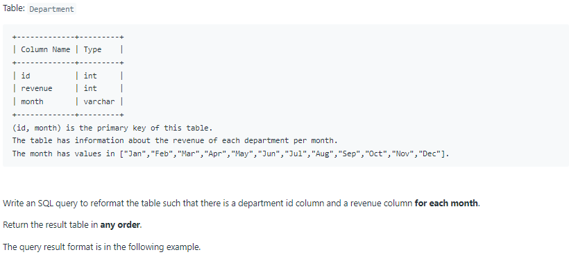
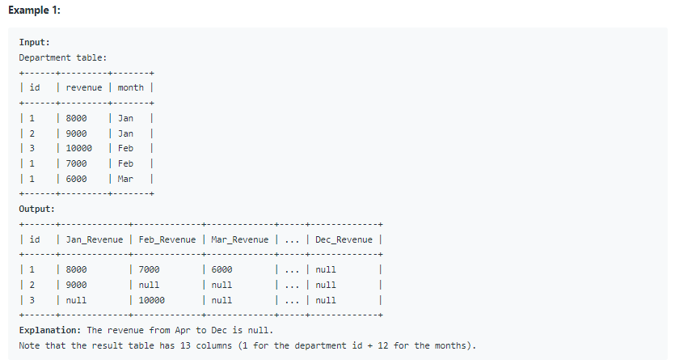

# Oracle Practice 08/07/2022

## Article Views I

- SQL schema:

  

- Example:

  

- <ins>query:</ins>
  ```sql
  select distinct author_id as id
  from Views
  where author_id = viewer_id
  order by author_id asc
  ```
