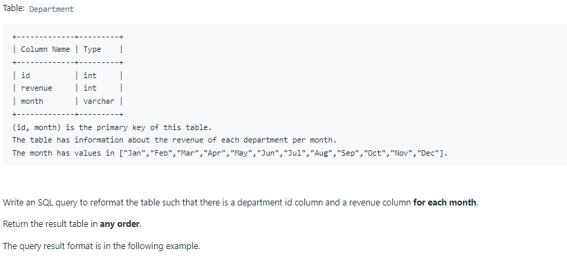
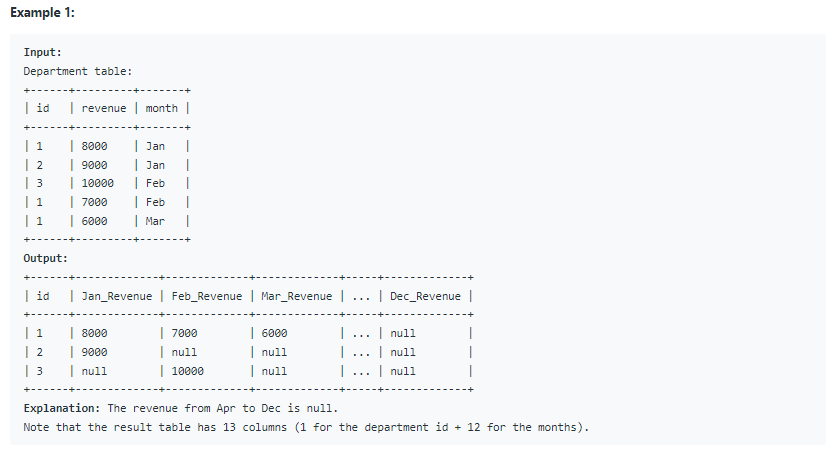

# Oracle Practice 08/07/2022

## Reformat Department Table

- SQL schema:

  

- Example:

  

- <ins>query:</ins>
  ```sql
  select *
  from
  (
    select
        id,
        revenue,
        month
    from Department
  )
  pivot
  (
    sum(revenue)
    for month in (
        'Jan' Jan_Revenue,
        'Feb' Feb_Revenue,
        'Mar' Mar_Revenue,
        'Apr' Apr_Revenue,
        'May' May_Revenue,
        'Jun' Jun_Revenue,
        'Jul' Jul_Revenue,
        'Aug' Aug_Revenue,
        'Sep' Sep_Revenue,
        'Oct' Oct_Revenue,
        'Nov' Nov_Revenue,
        'Dec' Dec_Revenue
    )
  ) pv
  ```
