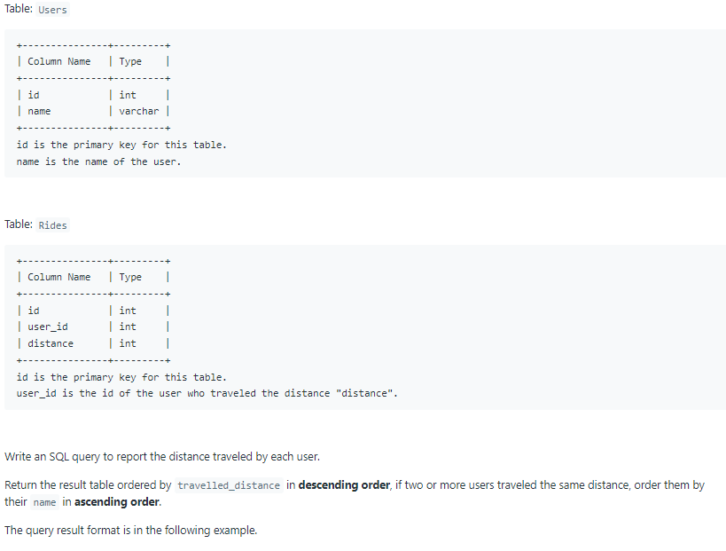
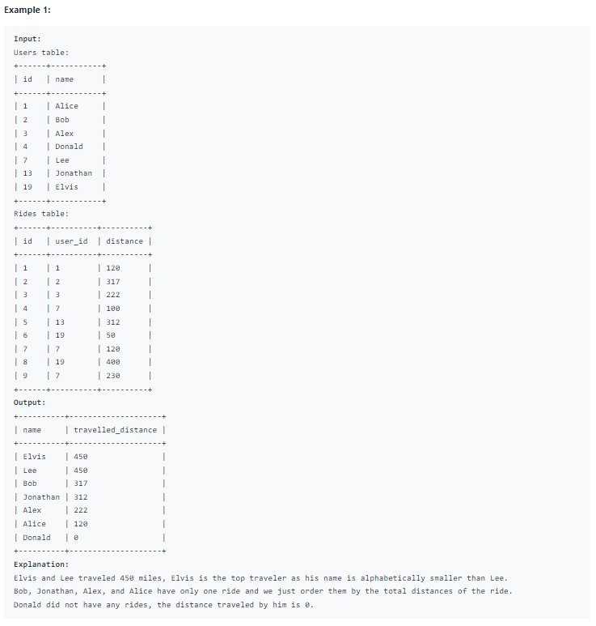

# Oracle Practice 08/07/2022

## Top Travellers

- SQL schema:

  

- Example:

  

- <ins>query:</ins>
  ```sql
  select
    a.name,
    nvl(sum(b.distance),0) as travelled_distance
  from Users a left join Rides b on a.id = b.user_id
  group by a.name
  order by travelled_distance desc, a.name asc
  ```
