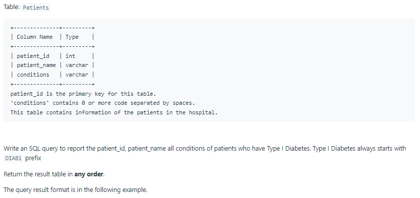
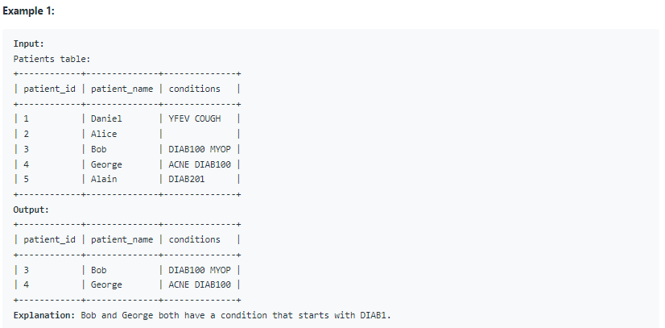

# Oracle Practice 23/06/2022

## Group Sold Products By The Date

- SQL schema:

  

- Example:

  

- <ins>query:</ins>
  ```sql
  select
    to_char(sell_date,'yyyy-mm-dd') sell_date,
    count(*) num_sold,
    listagg (product,',') within group (order by product) products
  from
  (
    select distinct *
    from Activities
  ) a
  group by sell_date
  ```
