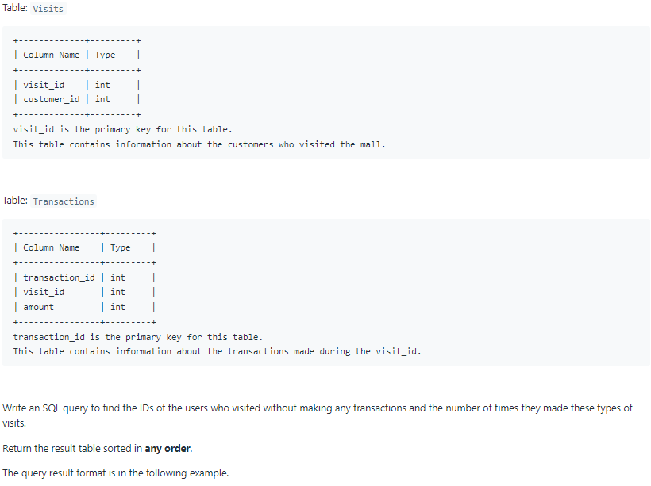
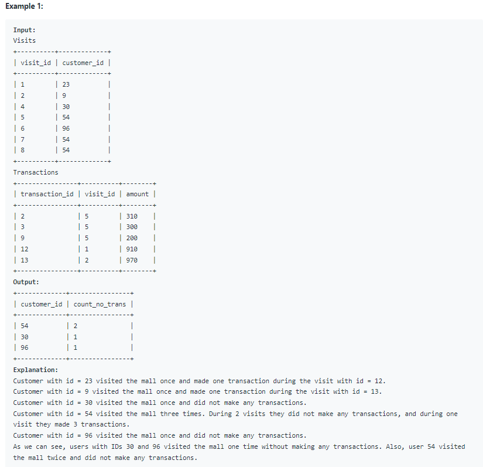

# Oracle Practice 07/07/2022

## Customer Who Visited but Did Not Make Any Transactions

- SQL schema:

  

- Example:

  

- <ins>query:</ins>
  ```sql
  select
    customer_id,
    count(*) count_no_trans
  from
  (
    select
      customer_id,
      visit_id
    from Visits
    where visit_id not in (
        select distinct visit_id
        from Transactions
    )
  )
  group by customer_id
  order by customer_id
  ```
