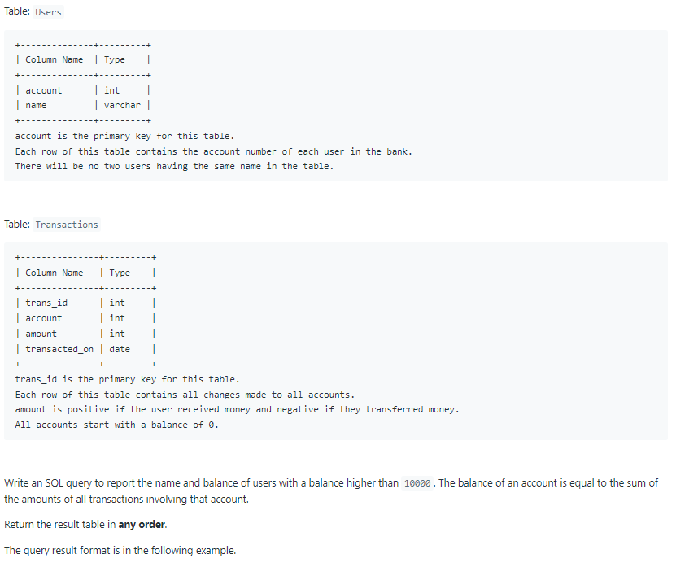
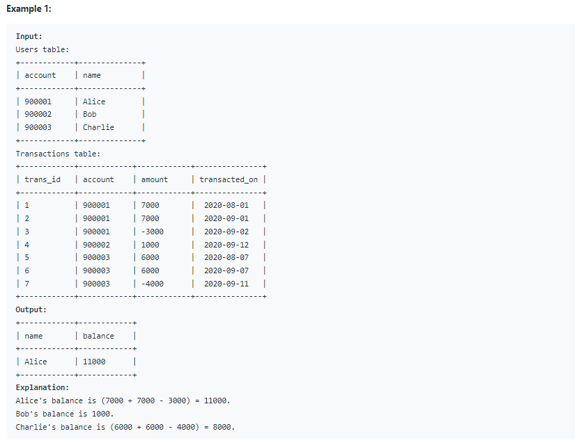

# Oracle Practice 07/07/2022

## Bank Account Summary II

- SQL schema:

  

- Example:

  

- <ins>query:</ins>
  ```sql
  select
    a.name,
    sum(b.amount) balance
  from Users a inner join Transactions b on a.account = b.account
  group by a.account, a.name
  having sum(b.amount) > 10000
  ```
