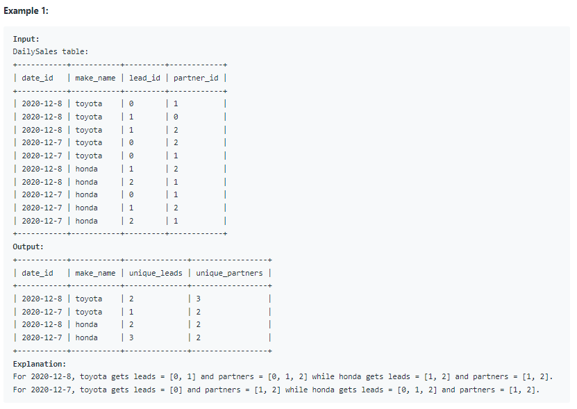

# Oracle Practice 07/07/2022

## Daily Leads and Partners

- SQL schema:

  

- Example:

  

- <ins>query:</ins>
  ```sql
  select
    to_char(date_id,'yyyy-mm-dd') as date_id,
    make_name,
    count(distinct lead_id) as unique_leads,
    count(distinct partner_id) as unique_partners
  from DailySales
  group by date_id, make_name
  ```
