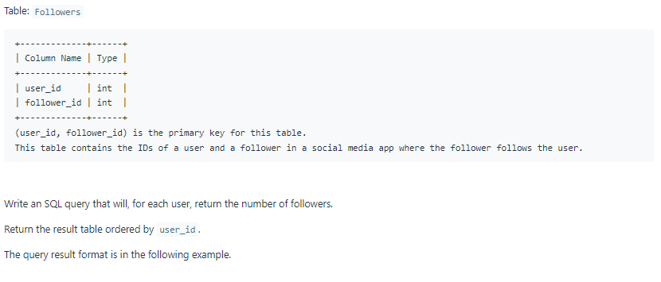
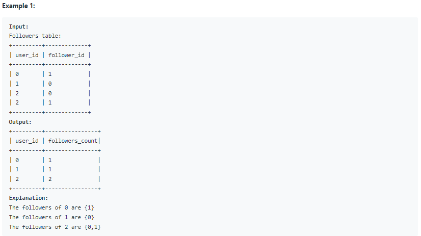

# Oracle Practice 07/07/2022

## Find Followers Count

- SQL schema:

  

- Example:

  

- <ins>query:</ins>
  ```sql
  select
    user_id,
    count(*) as followers_count
  from Followers
  group by user_id
  order by user_id
  ```
