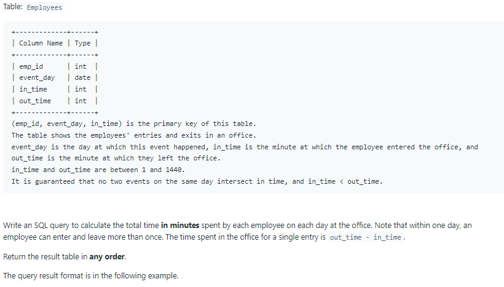
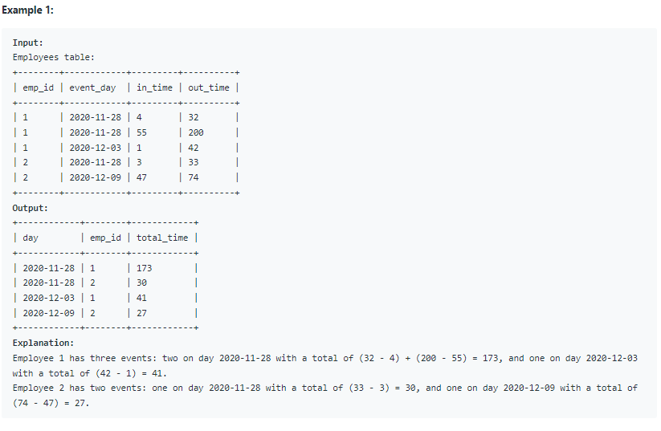

# Oracle Practice 07/07/2022

## Rearrange Products Table

- SQL schema:

  

- Example:

  

- <ins>query:</ins>

  ```sql
  select
    to_char(event_day,'yyyy-mm-dd') as day,
    emp_id,
    sum(out_time - in_time) as total_time
  from Employees
  group by event_day, emp_id
  ```
