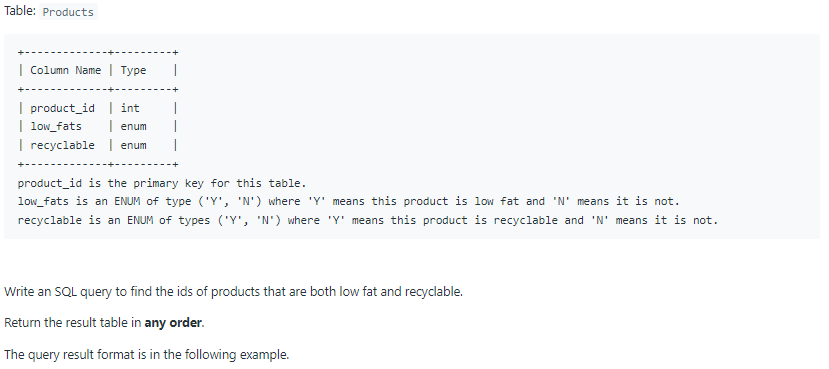
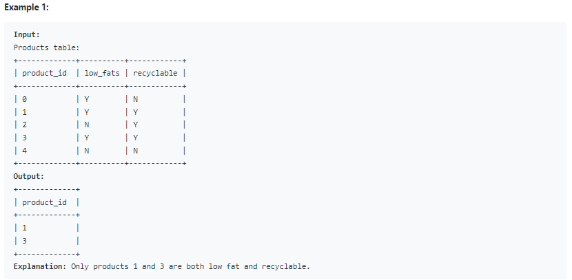

# Oracle Practice 06/07/2022

## Recyclable and Low Fat Products

- SQL schema:

  

- Example:

  

- <ins>query:</ins>
  ```sql
  select product_id
  from Products
  where low_fats = 'Y'
    and recyclable = 'Y'
  ```
