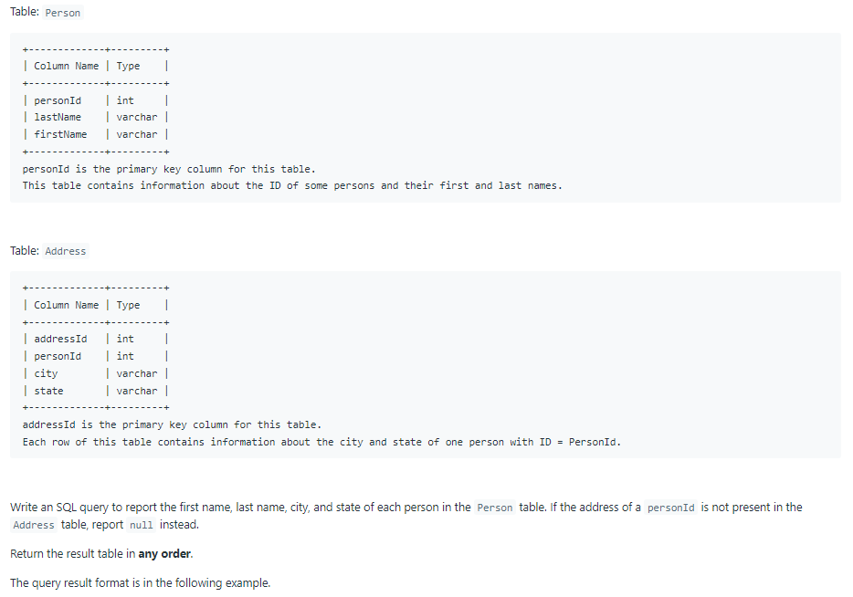
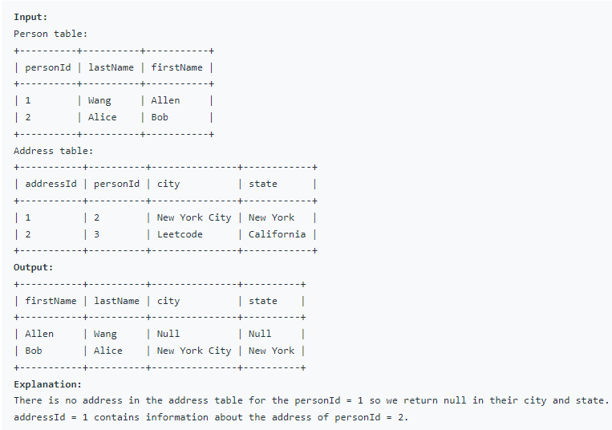

# Oracle Practice 23/06/2022

## Combine Two Tables

- SQL schema:

  

- Example:

  

- <ins>query:</ins>
  ```sql
  select
    p.firstName,
    p.lastName,
    a.city,
    a.state
  from Person p
    left join Address a on p.personId = a.personId
  ```
