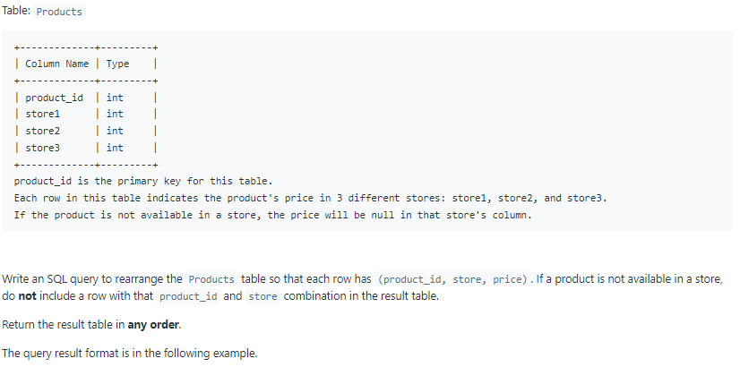
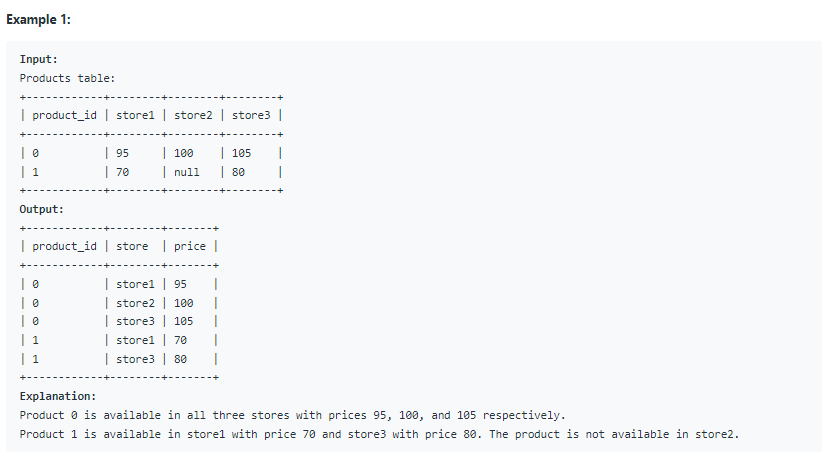

# Oracle Practice 07/07/2022

## Rearrange Products Table

- SQL schema:

  

- Example:

  

- <ins>query:</ins>

  ```sql
  select
    product_id,
    'store1' as store,
    store1 as price
  from Products
  where store1 is not null
  union all
  select
    product_id,
    'store2' as store,
    store2 as price
  from Products
  where store2 is not null
  union all
  select
    product_id,
    'store3' as store,
    store3 as price
  from Products
  where store3 is not null
  ```

- <ins>example query:</ins>
  ```sql
  select product_id, store, price
  from products
  unpivot exclude nulls (
    price
    for store
    in (
        store1 as 'store1'
        , store2 as 'store2'
        , store3 as 'store3'
    )
  )
  ```
