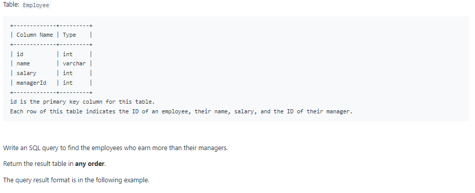
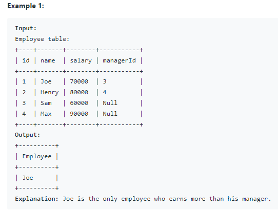

# Oracle Practice 24/06/2022

## Employees Earning More Than Their Managers

- SQL schema:

  

- Example:

  

- <ins>query:</ins>
  ```sql
  select
    tb.name as Employee
  from
  (
    select
      em1.name,
      em1.salary,
      em2.salary as e_sal
    from Employee em1
      left join Employee em2 on em1.managerId = em2.id
  ) tb
  where tb.salary > tb.e_sal
  ```
