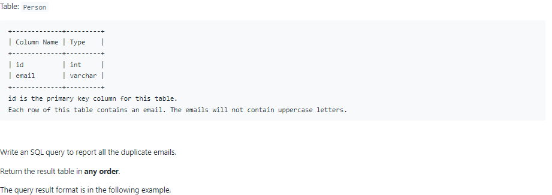
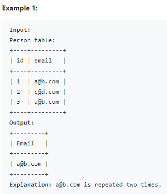

# Oracle Practice 27/06/2022

## Duplicate Emails

- SQL schema:

  

- Example:

  

- <ins>query:</ins>
  ```sql
  select
    email as "Email"
  from Person
  group by email
  having count(email) > 1
  ```
