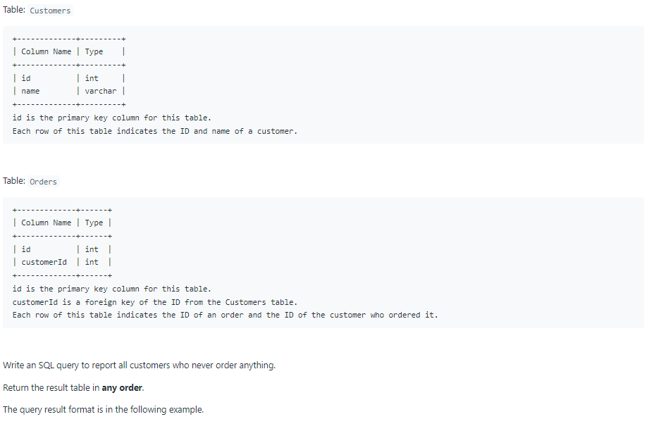
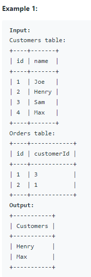

# Oracle Practice 28/06/2022

## Customers Who Never Order

- SQL schema:

  

- Example:

  

- <ins>query:</ins>
  ```sql
  select
    name as "Customers"
  from Customers
  where id not in (
    select
      customerId
    from Orders
  )
  order by name
  ```
