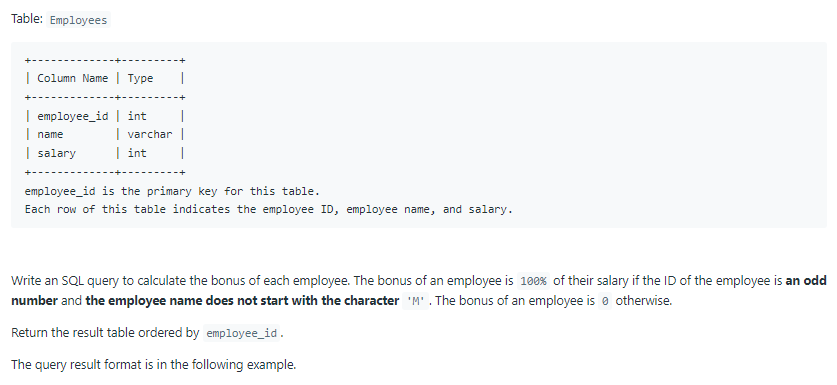
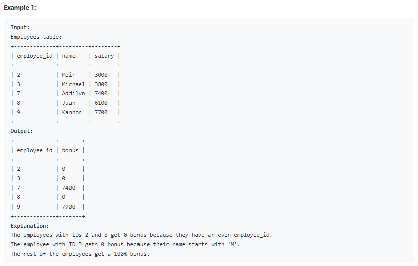

# Oracle Practice 06/07/2022

## Calculate Special Bonus

- SQL schema:

  

- Example:

  

- <ins>query:</ins>
  ```sql
  select
    a.employee_id,
    nvl(b.salary,0) as bonus
  from Employees a left join
  (
    select
      employee_id,
      salary
    from Employees
    where mod(employee_id,2) = 1 and name not like 'M%'
  ) b on a. employee_id = b.employee_id
  order by a.employee_id
  ```
