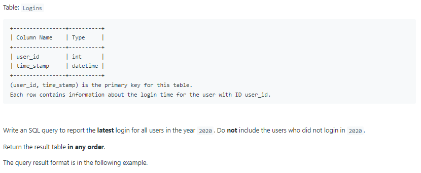
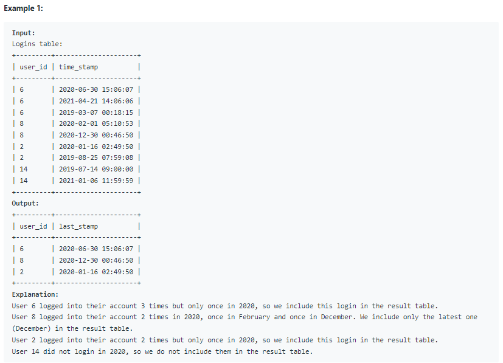

# Oracle Practice 05/07/2022

## The Latest Login in 2020

- SQL schema:

  

- Example:

  

- <ins>query:</ins>
  ```sql
  select
    user_id,
    max(time_stamp) last_stamp
  from Logins
  where to_char(time_stamp,'yyyy') = 2020
  group by user_id
  ```
