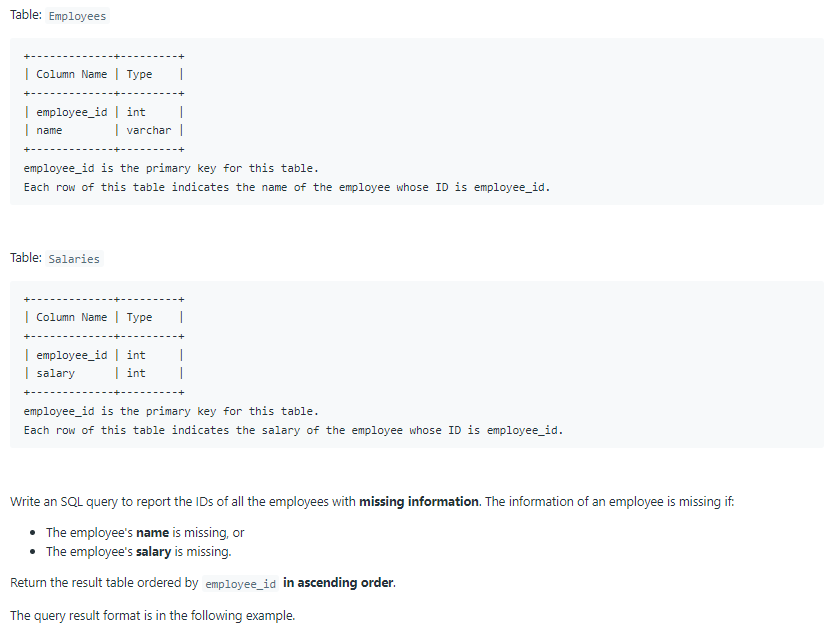
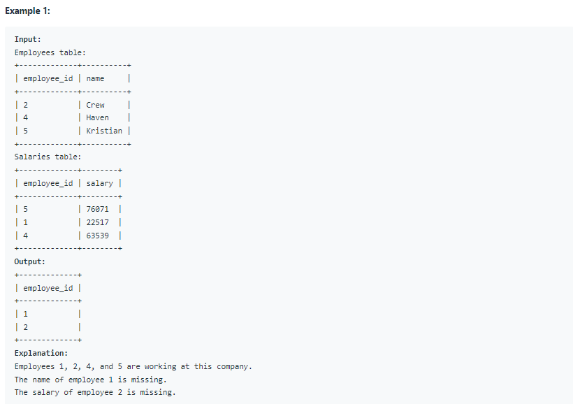

# Oracle Practice 05/07/2022

## Employees With Missing Information

- SQL schema:

  

- Example:

  

- <ins>query:</ins>
  ```sql
  select employee_id
  from
  (
    select
        nvl(a.employee_id,b.employee_id) as employee_id,
        a.name,
        b.salary
    from Employees a full outer join Salaries b on a.employee_id = b. employee_id
    order by employee_id
  )
  where name is null
    or salary is null
  ```
