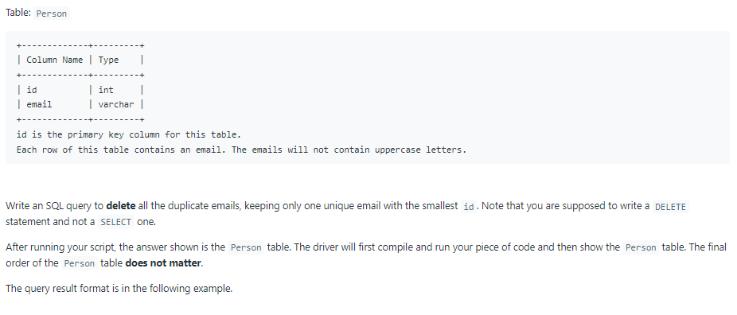
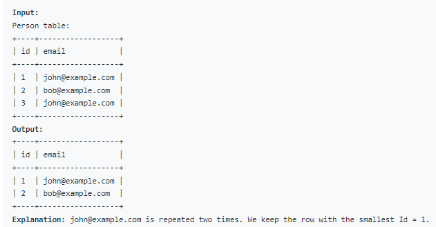

# Oracle Practice 30/06/2022

## Delete Duplicate Emails

- SQL schema:

  

- Example:

  

- <ins>query:</ins>
  ```sql
  delete from Person
  where id in
  (
    select a.id
    from
    (
        select
          id,
          row_number() over (partition by email order by id) rn
        from Person
    ) a
    where a.rn > 1
  )
  ```
