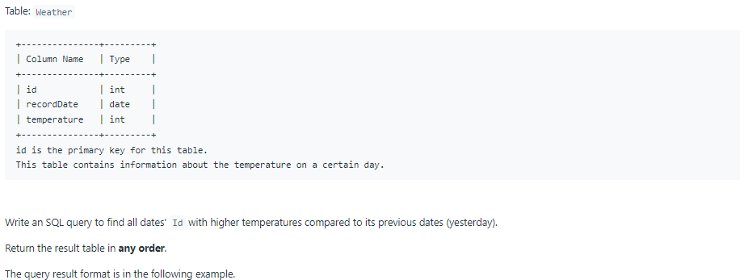
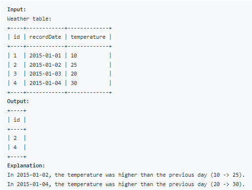

# Oracle Practice 30/06/2022

## Rising Temperature

- SQL schema:

  

- Example:

  

- <ins>query:</ins>
  ```sql
  select
    w1.id
  from Weather w1, Weather w2
  where w1.temperature > w2.temperature
    and w1.recordDate - w2.recordDate = 1
  ```
