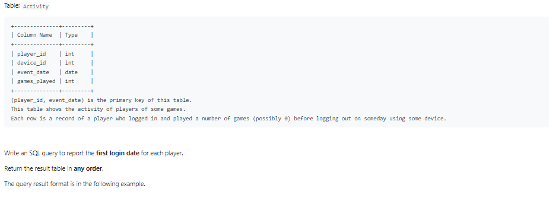
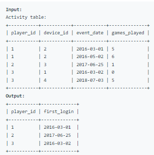

# Oracle Practice 30/06/2022

## Game Play Analysis I

- SQL schema:

  

- Example:

  

- <ins>query:</ins>
  ```sql
  select
    player_id,
    to_char(min(event_date),'yyyy-mm-dd') as first_login
  from Activity
  group by player_id
  ```
