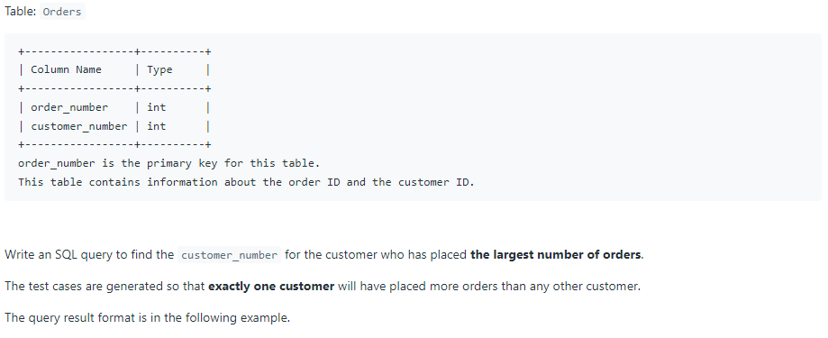
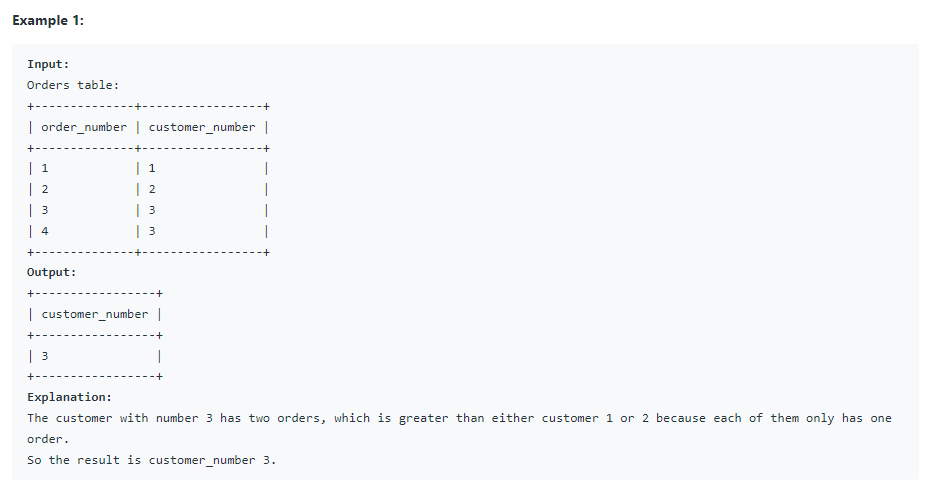

# Oracle Practice 08/07/2022

## Customer Placing the Largest Number of Orders

- SQL schema:

  

- Example:

  

- <ins>query:</ins>

  ```sql
  select *
  from
  (
    select customer_number
    from Orders
    group by customer_number
    order by count(customer_number) desc
  )
  where rownum=1;
  ```
