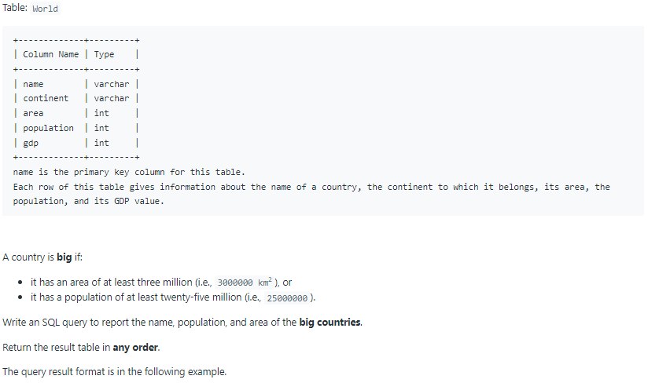
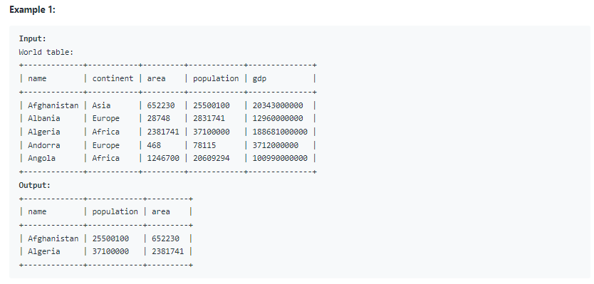

# Oracle Practice 06/07/2022

## Big Countries

- SQL schema:

  

- Example:

  

- <ins>query:</ins>
  ```sql
  select
    name,
    population,
    area
  from World
  where area >= 3000000
    or population >= 25000000
  ```
