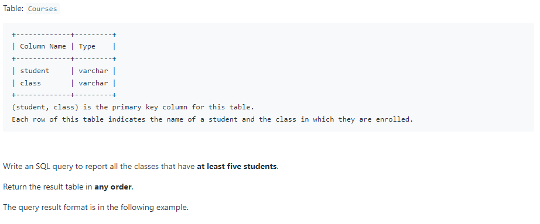
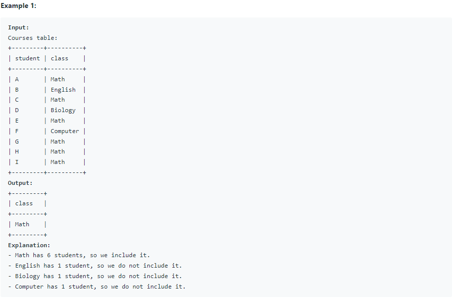

# Oracle Practice 08/07/2022

## Classes More Than 5 Students

- SQL schema:

  

- Example:

  

- <ins>query:</ins>

  ```sql
  select class
  from Courses
  group by class
  having count(*) >= 5
  ```
