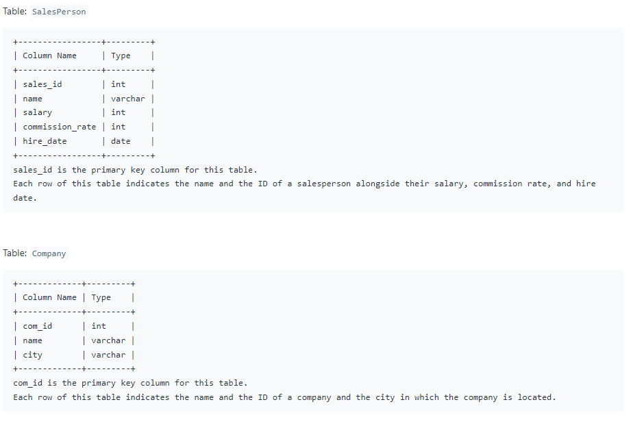
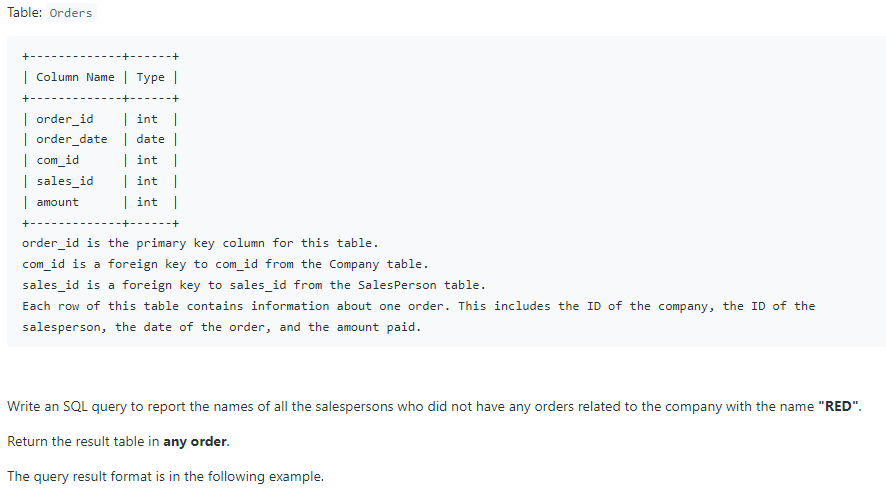
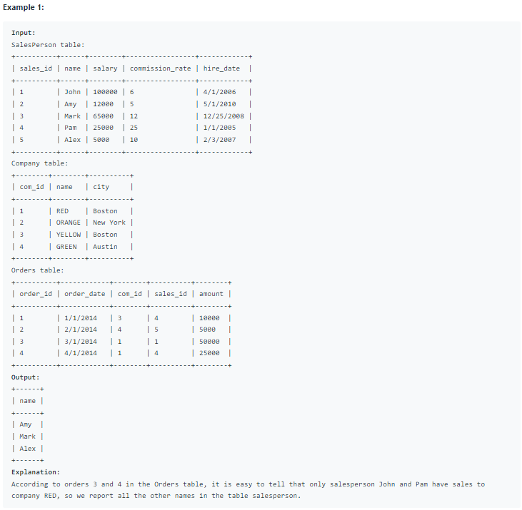

# Oracle Practice 08/07/2022

## Sales Person

- SQL schema:

  
  

- Example:

  

- <ins>query:</ins>

  ```sql
  select distinct name
  from SalesPerson
  where sales_id not in (
    select o.sales_id
    from Orders o inner join Company c on o.com_id = c.com_id
    where c.name = 'RED'
  )
  order by name
  ```
