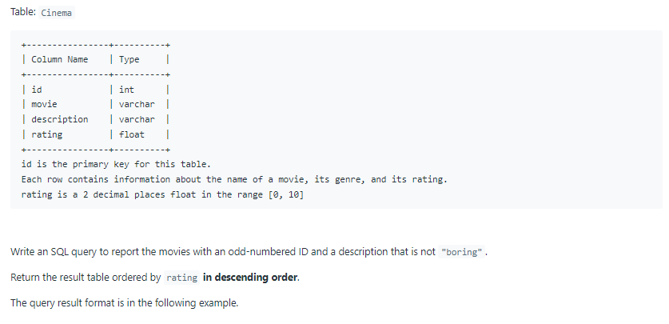
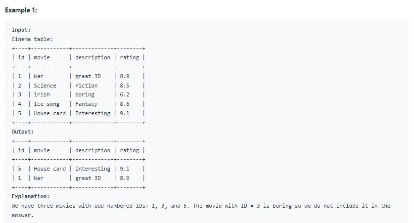

# Oracle Practice 08/07/2022

## Not Boring Movies

- SQL schema:

  

- Example:

  

- <ins>query:</ins>

  ```sql
  select *
  from Cinema
  where mod(id,2) = 1
    and description not like 'boring'
  order by rating desc
  ```
