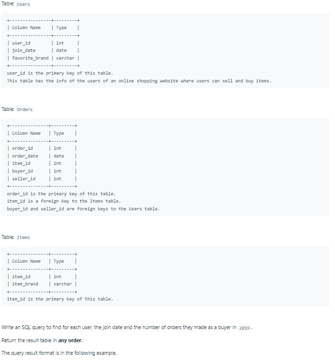
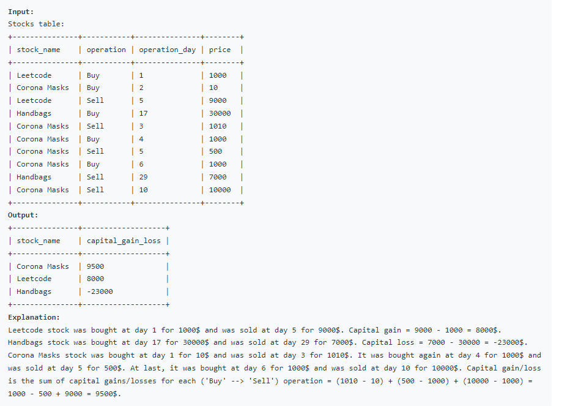

# Oracle Practice 01/07/2022

## Market Analysis I

- SQL schema:

  

- Example:

  

- <ins>query:</ins>
  ```sql
  select
      u.user_id as buyer_id,
      to_char(join_date,'yyyy-mm-dd') as join_date,
      nvl(tb.cnt,0) as orders_in_2019
  from Users u
    left join (
      select
        buyer_id,
        count(order_date) cnt
      from Orders
      where to_char(order_date,'yyyy') = '2019'
      group by buyer_id
    ) tb
  on u.user_id = tb.buyer_id
  ```
