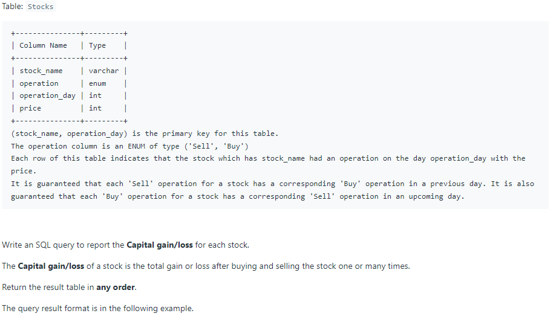

# Oracle Practice 01/07/2022

## Capital Gain/Loss

- SQL schema:

  

- Example:

  

- <ins>query:</ins>
  ```sql
  select
    a.stock_name,
    sum (a.price) capital_gain_loss
  from
  (
    select
      stock_name,
      decode('Buy',operation, -1 * price, price) price
    from Stocks
  ) a
  group by a.stock_name
  order by a.stock_name
  ```
