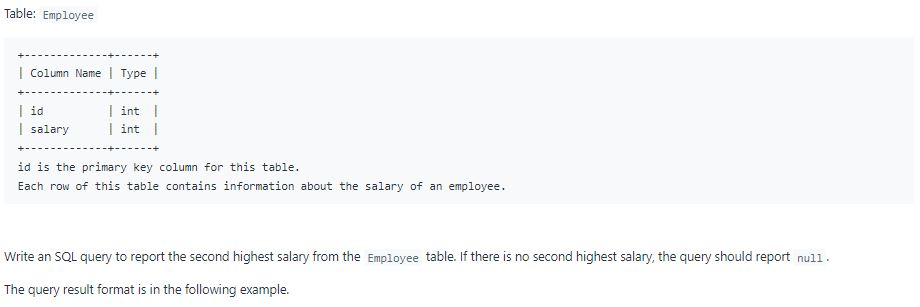
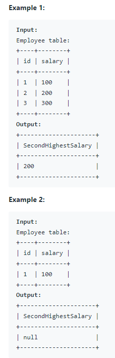

# Oracle Practice 23/06/2022

## Second Highest Salary

- SQL schema:

  

- Example:

  

- <ins>query:</ins>
  ```sql
  select
    max(salary) as "SecondHighestSalary"
  from Employee
  where salary not in (
    select
      max(salary)
    from Employee
  )
  ```
