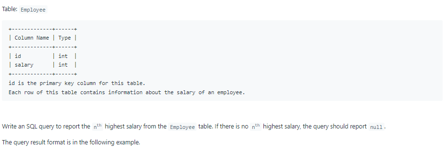
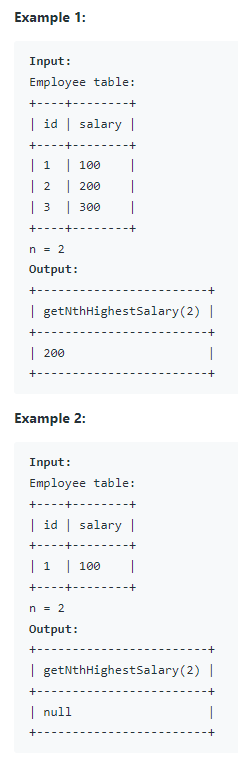

# Oracle Practice 23/06/2022

## Nth Highest Salary

- SQL schema:

  

- Example:

  

- <ins>query:</ins>

  ```sql
  CREATE FUNCTION getNthHighestSalary(N IN NUMBER) RETURN NUMBER IS
  result NUMBER;
  BEGIN
        SELECT DISTINCT SALARY
        INTO RESULT
        FROM (
            SELECT
              E.ID,
              E.SALARY,
              DENSE_RANK() OVER ( ORDER BY SALARY DESC) RANK
            FROM Employee E
        )
        WHERE RANK=N;
    RETURN result;
  END;
  ```
