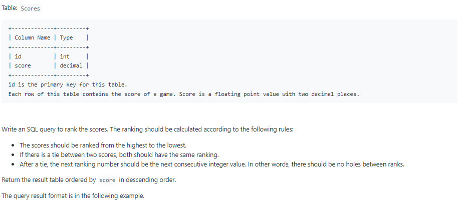
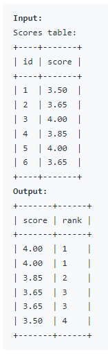

# Oracle Practice 24/06/2022

## Rank Scores

- SQL schema:

  

- Example:

  

- <ins>query:</ins>
  ```sql
  select
    score "score",
    dense_rank() over (order by score desc) "rank"
  from Scores
  ```
