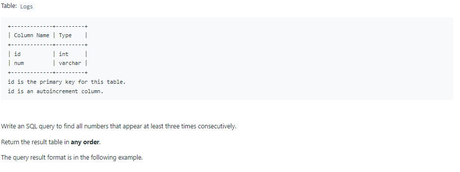
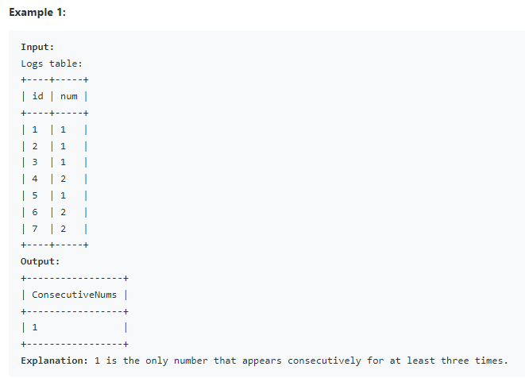

# Oracle Practice 24/06/2022

## Consecutive Numbers

- SQL schema:

  

- Example:

  

- <ins>query:</ins>
  ```sql
  select
    distinct a.Num as ConsecutiveNums
  from
  (
    select
      Id,
      Num,
      lead(ID, 2, -1) OVER (PARTITION BY Num ORDER BY id) AS id2
    from Logs
  ) a
  where a.id2 = a.id + 2
  ```
