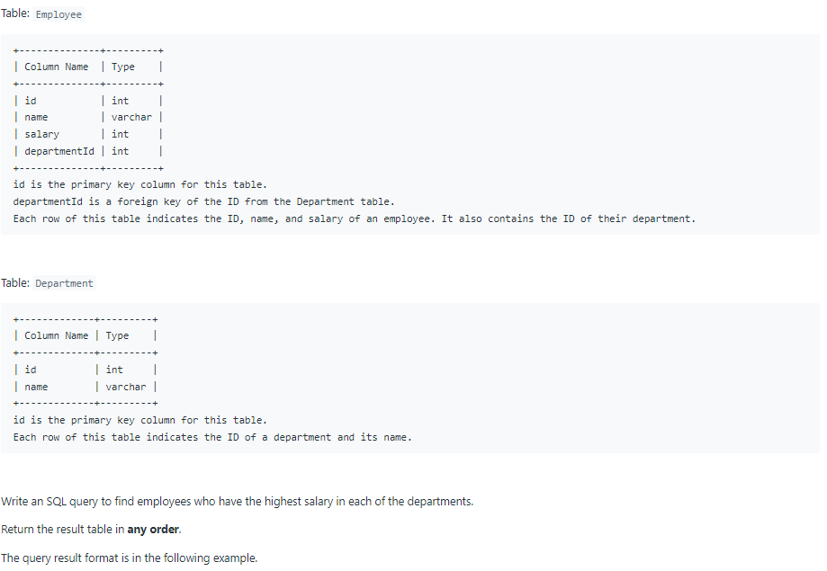

# Oracle Practice 29/06/2022

## Department Highest Salary

- SQL schema:

  

- Example:

  

- <ins>query:</ins>
  ```sql
  select
    a.Department,
    a.Employee,
    a.Salary
  from
  (
    select
        de.name as Department,
        em.name as Employee,
        em.salary as Salary,
        dense_rank() over (partition by em.departmentId order by em.salary desc) as rk
    from Employee em
      left join Department de on em.departmentId = de.id
  ) a
  where a.rk = 1
  ```
