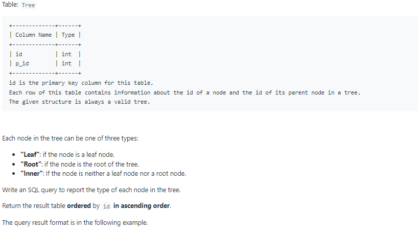

# Oracle Practice 05/07/2022

## Tree Node

- SQL schema:

  

- Example:

  
  

- <ins>query:</ins>

  ```sql
  select
    id,
    case
        when p_id is null then 'Root'
        when id in (
            select distinct p_id
            from Tree
        ) then 'Inner'
        else 'Leaf'
    end as type
  from Tree
  ```
