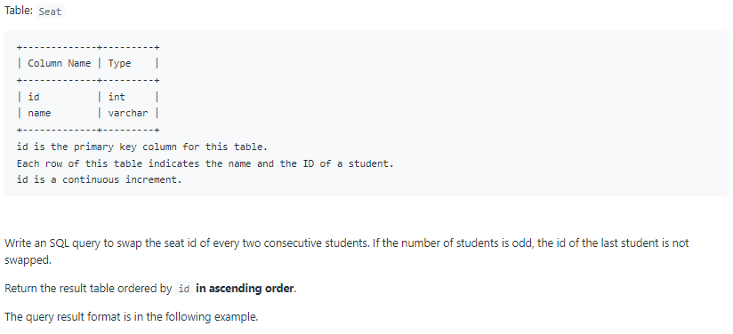

# Oracle Practice 04/07/2022

## Exchange Seats

- SQL schema:

  

- Example:

  

- <ins>query:</ins>
  ```sql
  select
    row_number() over (order by a.new_id) as id,
    a.student
  from
  (
    select
        id,
        student,
        case
            when mod(id,2) = 0 then id - 1
            else id+1
        end as new_id
    from Seat
        order by new_id
  ) a
  ```
