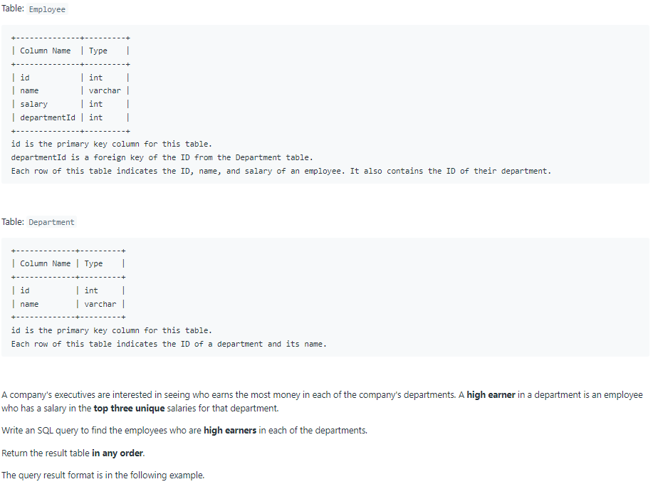
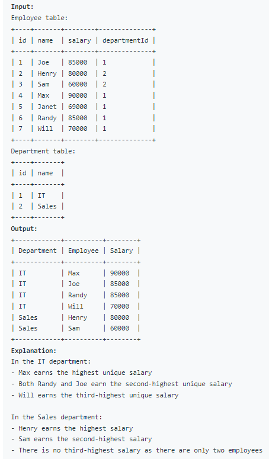

# Oracle Practice 29/06/2022

## Department Top Three Salaries

- SQL schema:

  

- Example:

  

- <ins>query:</ins>
  ```sql
  select
    tb.Department,
    tb.Employee,
    tb.Salary
  from
  (
    select
        de.name as Department,
        em.name as Employee,
        em.salary as Salary,
        dense_rank() over (partition by em.departmentId order by em.salary desc) as rank
    from Employee em, Department de
    where em.departmentId = de.id
  ) tb
  where tb.rank <= 3
  ```
