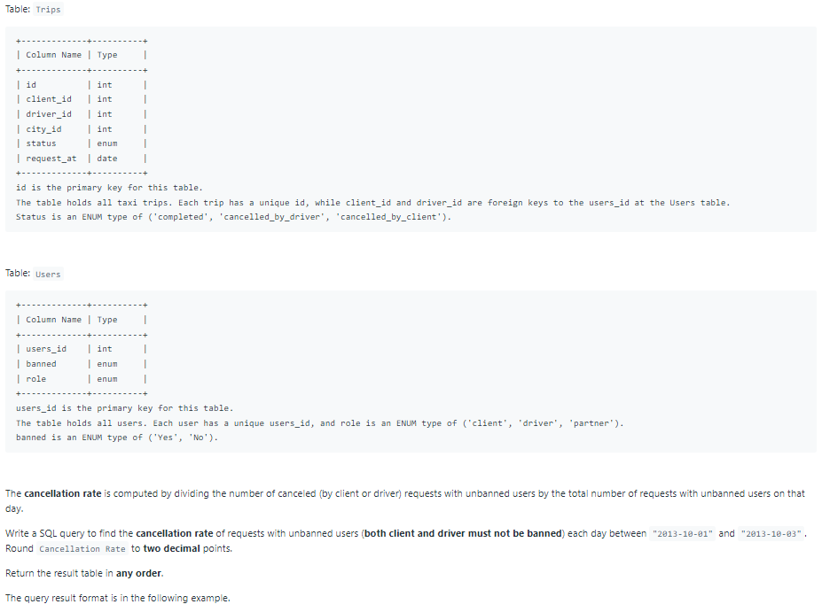
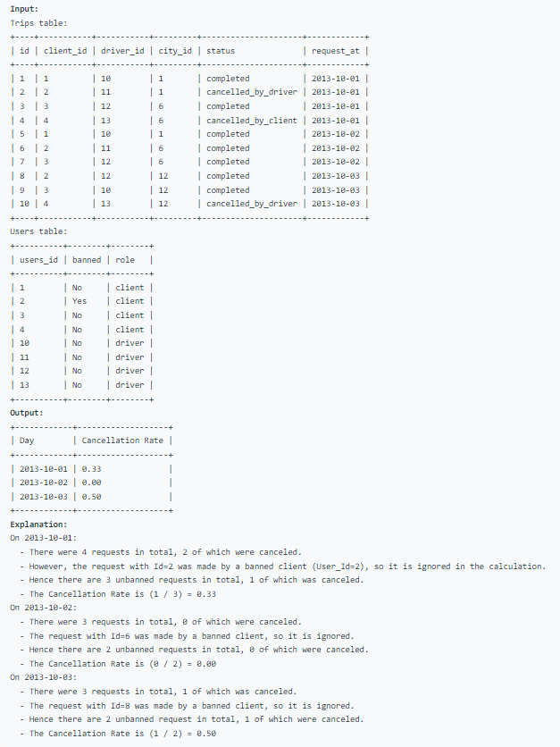

# Oracle Practice 30/06/2022

## Trips and Users

- SQL schema:

  

- Example:

  

- <ins>query:</ins>
  ```sql
  select
    t.request_at as day,
    round(count(case when t.status != 'completed' then 1 end)/count(*), 2) "Cancellation Rate"
  from Trips t
    join Users u1 on u1.users_id = t.client_id and u1.banned = 'No'
    join Users u2 on u2.users_id = t.driver_id and u2.banned = 'No'
  where t.request_at >= '2013-10-01'
    and t.request_at <= '2013-10-03'
  group by t.request_at
  order by t.request_at
  ```
