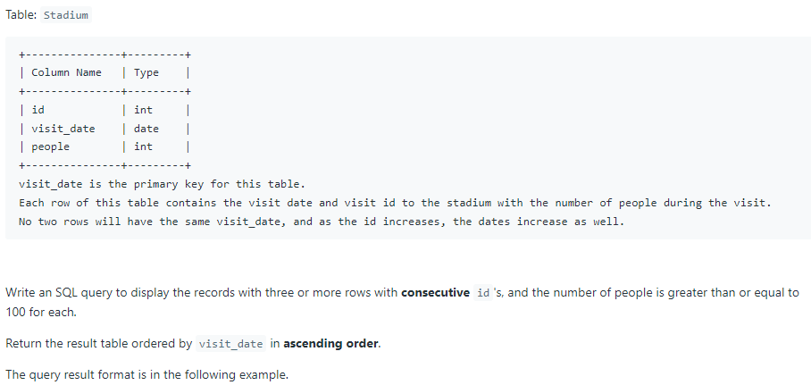
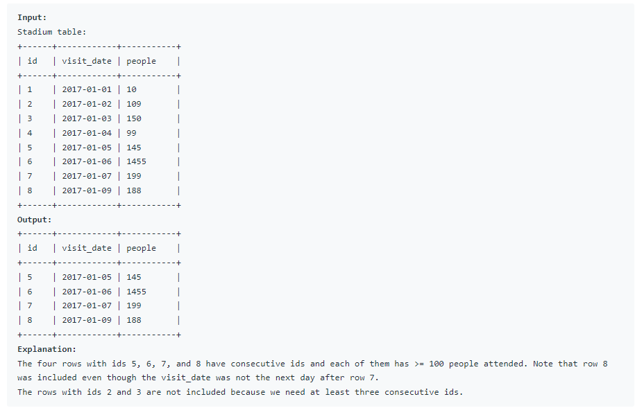

# Oracle Practice 01/07/2022

## Human Traffic of Stadium

- SQL schema:

  

- Example:

  

- <ins>query:</ins>

  ```sql
  select
    id,
    to_char(visit_date,'yyyy-mm-dd') visit_date,
    people
  from
  (
    select
      id,
      visit_date,
      people,
      count(id) over(partition by rk) as cnt
    from
    (
        select
          id,
          visit_date,
          people,
          id - row_number() over (order by id ) as rk
        from stadium
        where people >= 100
        order by id
    ) a
  )b
  where cnt > = 3
  order by id
  ```

- <ins>Example query:</ins>
  ```sql
  select
    id as "id",
    visit_date as "visit_date",
    people as "people"
  from
  (
    select
      id,
      visit_date,
      people,
      count(*) over(order by id range between current row and 2 following) Following_cnt,
      count(*) over(order by id range between 2 preceding and current row) Preceding_cnt,
      count(*) over(order by id range between 1 preceding and 1 following) Current_Count
    from
    (
      select
        id,
        to_char(visit_date, 'yyyy-mm-dd') visit_date,
        people
      from Stadium
      where people >= 100
    ) a
  ) b
  where Following_cnt =3
    or Preceding_cnt =3
    or Current_Count = 3
  ```
